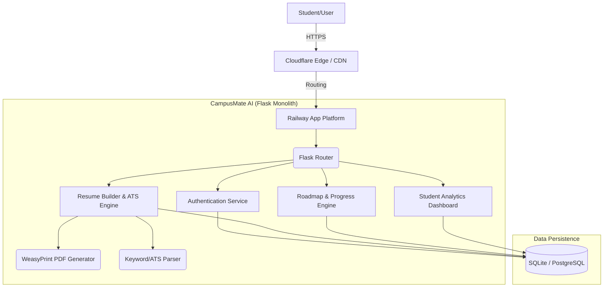

# CampusMate AI - Architecture Diagram

### Stack Components
- **Frontend**: HTML5, Vanilla JavaScript, Bootstrap 5 CSS, Custom CSS (Glassmorphism UI)
- **Backend**: Python 3.10+, Flask Framework
- **Database**: SQLite (Development) / PostgreSQL ready
- **Rendering**: Jinja2 Templating
- **PDF Generation**: WeasyPrint / GTK
- **Deployment**: Railway
