# CampusMate AI
AI-Powered Student Career Operating System
Microsoft Agents League 2026 Submission

---

## Problem Statement
Students use disconnected tools for:
* Resume Building
* ATS Optimization
* Career Roadmapping
* Interview Preparation
* Internship Discovery

This causes fragmented career growth and poor placement readiness.

---

## Solution
CampusMate AI unifies:
* ATS Resume Builder
* AI Resume Analyzer
* Learning Roadmap Engine
* AI Interview Simulator
* Internship Command Center
* Student Profile System
* Analytics Dashboard

inside a single platform.

---

## Key Features

### ATS Resume Builder
Live editing
Professional templates
One-page ATS format
PDF export

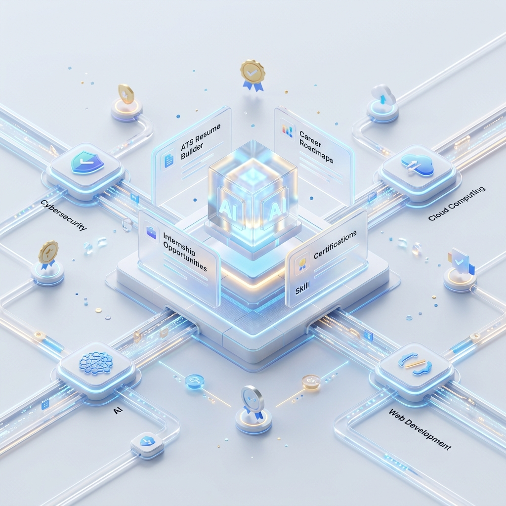

---

### Resume Live Preview
Real-time rendering
ATS-friendly formatting
Responsive preview


---

### ATS Analyzer
Resume scoring
Keyword matching
Improvement suggestions


---

### Professional PDF Export
Single-page ATS format
Production-ready layout
Consistent rendering


---

### Learning Roadmap Engine
200-node progression system
Career pathways
Milestone tracking

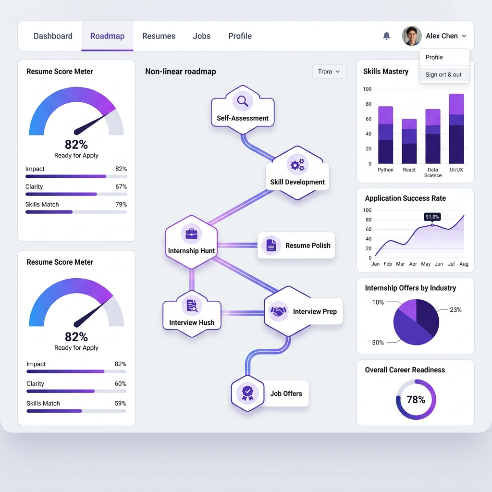

---

### Roadmap Resource Explorer
Step-by-step learning resources
Curated references
Checkpoint guidance

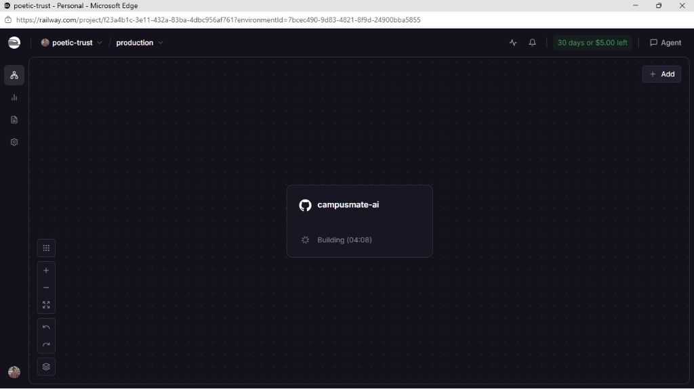

---

### AI Interview Simulator
Technical interviews
HR interviews
Voice-enabled practice

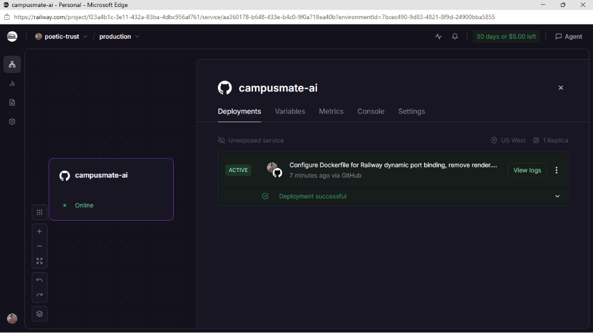

---

### Internship Command Center
Opportunity matching
Readiness scoring
Skill-gap analysis

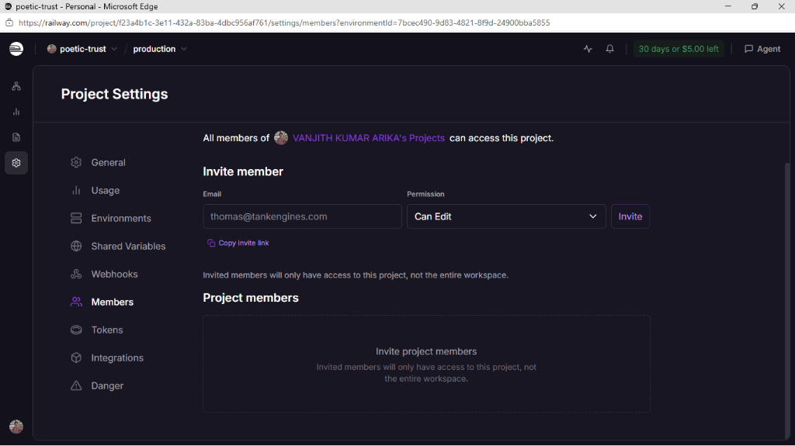

---

### Student Profile System
Skill tracking
Achievement management
Career preferences

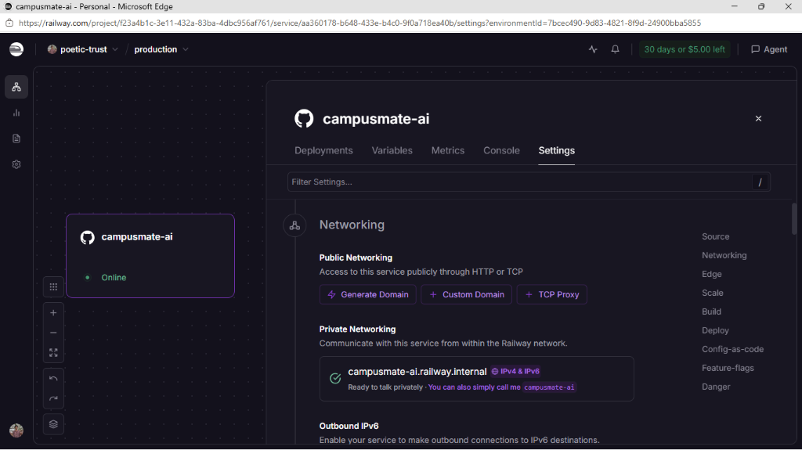

---

### Admin Analytics Dashboard
Platform analytics
Security monitoring
Student insights

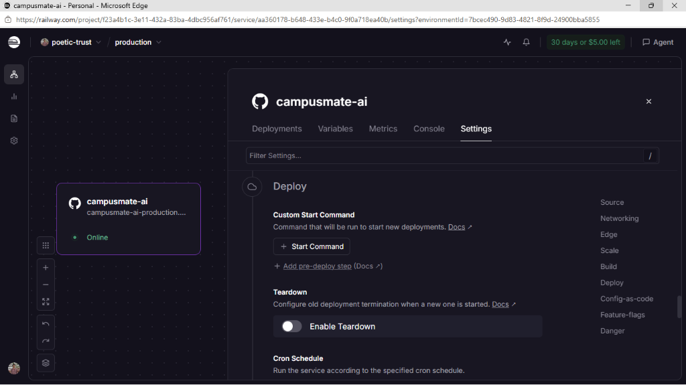

---

## Platform Walkthrough

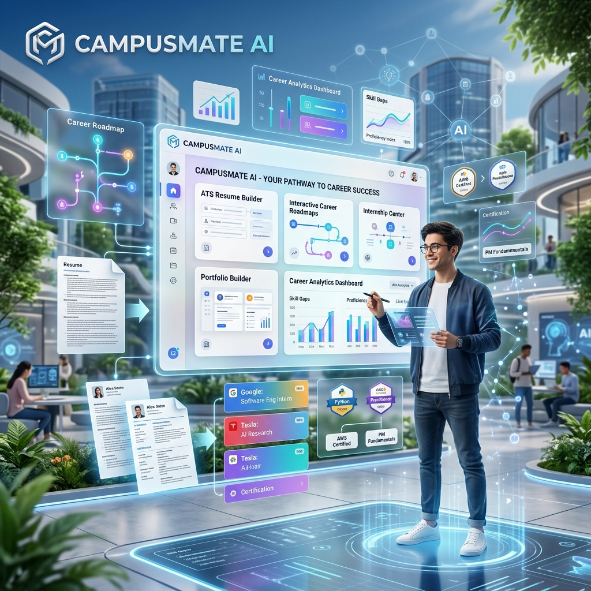
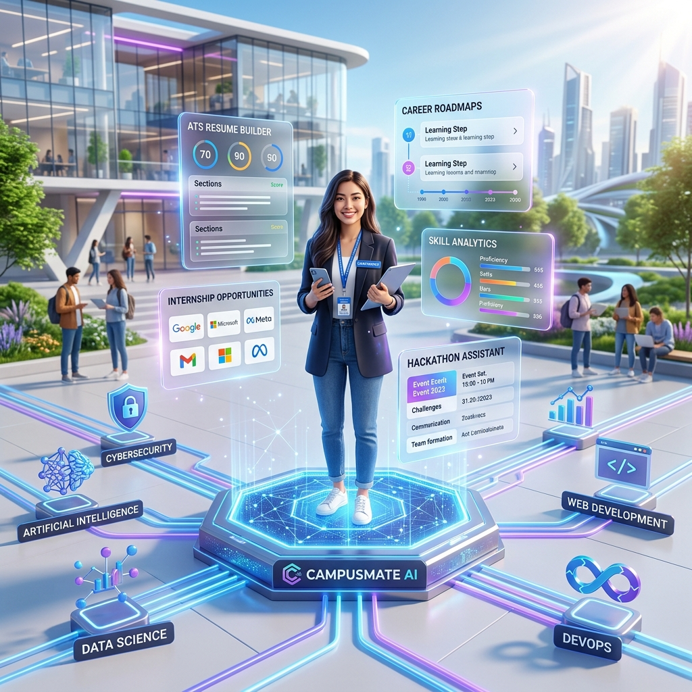

---

## Authentication System

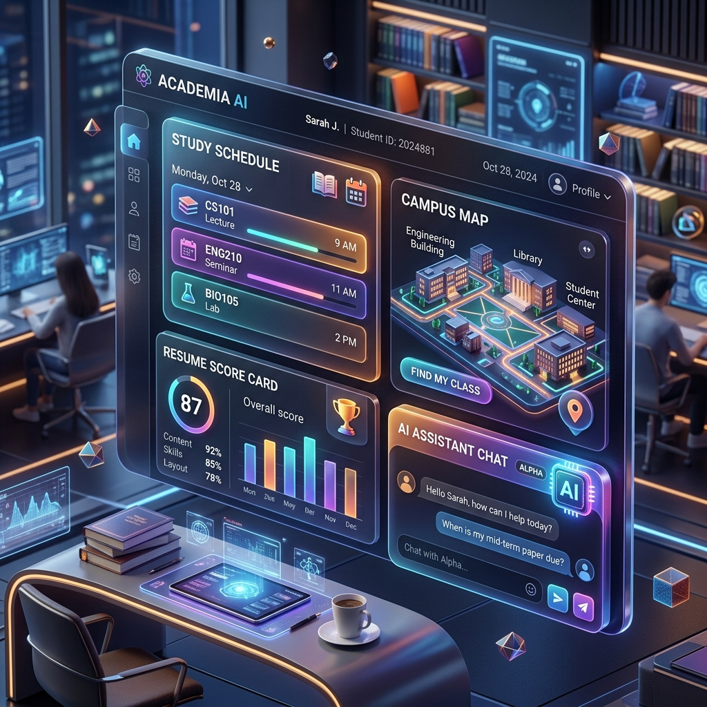
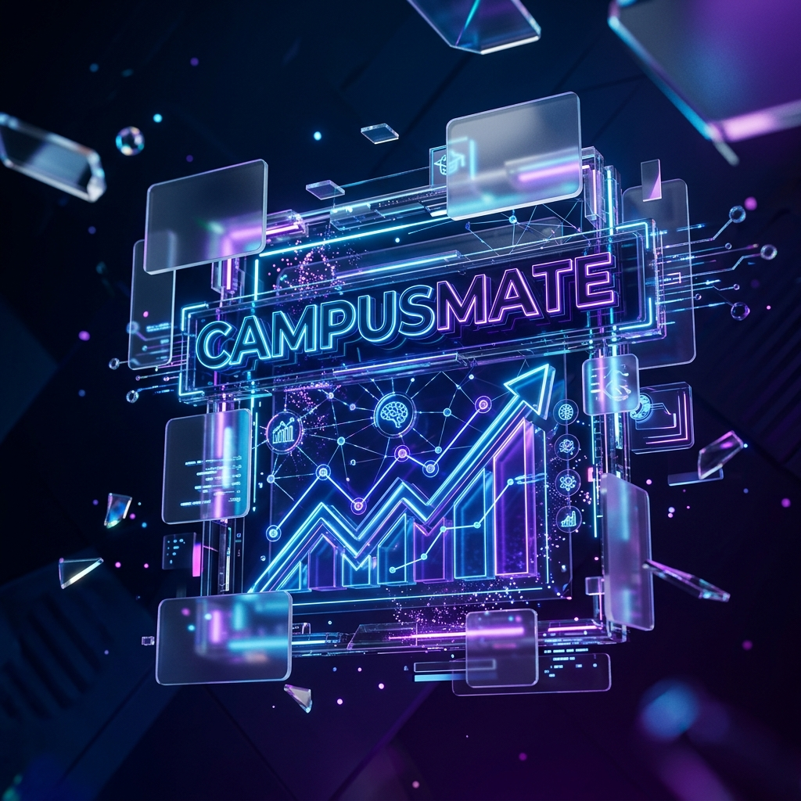

---

## System Architecture

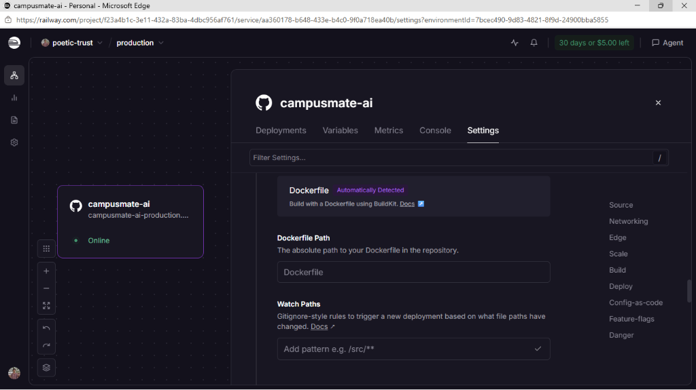

Cloudflare securely proxies traffic to our Railway instance where the Flask Backend orchestrates the Authentication Service and orchestrates the AI engines (Resume Engine, ATS Engine, Roadmap Engine, and Analytics Module). The system utilizes a dual-ready SQLite/PostgreSQL layer for rapid development and scalable production.

---

## Technology Stack

**Frontend**
* HTML5
* CSS3
* Bootstrap 5
* JavaScript

**Backend**
* Python
* Flask

**Database**
* SQLite
* PostgreSQL Ready

**AI Services**
* Gemini
* Microsoft Agent Ecosystem

**Deployment**
* Railway

---

## Security

**Implemented:**
* Environment Variable Protection
* Secret Key Hardening
* Upload Size Limits
* Session Protection
* Password Hashing
* Production Deployment Configuration

**Security Audit Status:**
`PASS`

---

## Installation

1. **Clone the repository:**
   ```bash
   git clone https://github.com/251801390006-blip/campusmate-ai.git
   cd campusmate-ai
   ```

2. **Set up virtual environment:**
   ```bash
   python -m venv .venv
   .venv\Scripts\activate  # Windows
   source .venv/bin/activate  # macOS / Linux
   ```

3. **Install dependencies:**
   ```bash
   pip install -r requirements.txt
   ```

4. **Run the server:**
   ```bash
   python main.py
   ```
   Open `http://127.0.0.1:8000` in your browser.

---

## Environment Variables
Reference `.env.example`. No secrets inside repository.

---

## Demo
Live Application: https://campusmate-ai-production.up.railway.app

---

## License
MIT License

---

## Microsoft Agents League Submission
**Track:** AI Career Growth & Student Productivity
**Status:** Submission Ready
**Repository Visibility:** Public
**Security Audit:** Passed
**Documentation:** Complete
**Deployment:** Live
