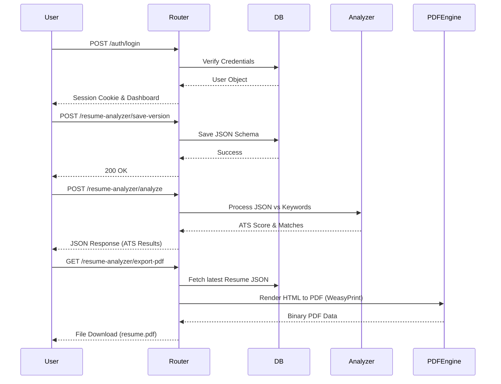

# CampusMate AI - System Workflow

```mermaid
sequenceDiagram
    participant User
    participant Router
    participant DB
    participant Analyzer
    participant PDFEngine

    %% Authentication
    User->>Router: POST /auth/login
    Router->>DB: Verify Credentials
    DB-->>Router: User Object
    Router-->>User: Session Cookie & Dashboard

    %% Resume Builder Flow
    User->>Router: POST /resume-analyzer/save-version
    Router->>DB: Save JSON Schema
    DB-->>Router: Success
    Router-->>User: 200 OK

    %% ATS Analysis Flow
    User->>Router: POST /resume-analyzer/analyze
    Router->>Analyzer: Process JSON vs Keywords
    Analyzer-->>Router: ATS Score & Matches
    Router-->>User: JSON Response (ATS Results)

    %% PDF Export Flow
    User->>Router: GET /resume-analyzer/export-pdf
    Router->>DB: Fetch latest Resume JSON
    Router->>PDFEngine: Render HTML to PDF (WeasyPrint)
    PDFEngine-->>Router: Binary PDF Data
    Router-->>User: File Download (resume.pdf)
```
